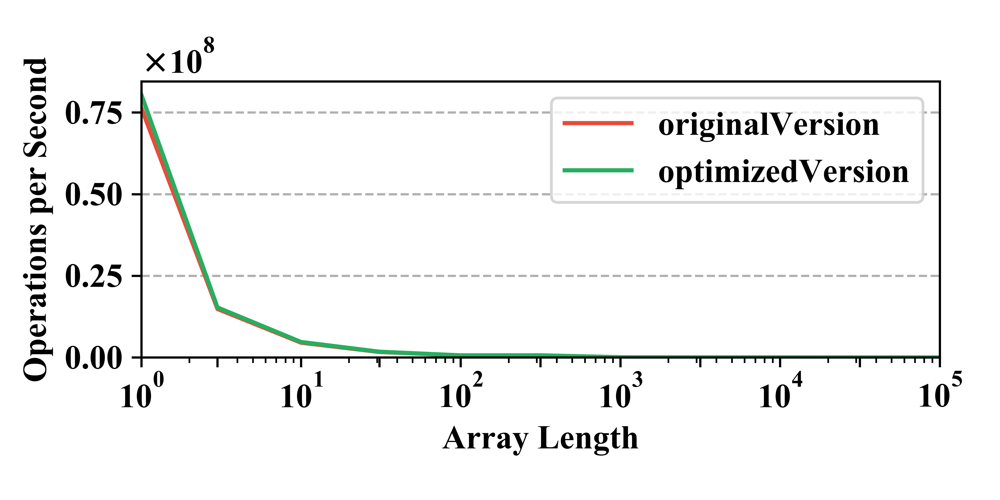
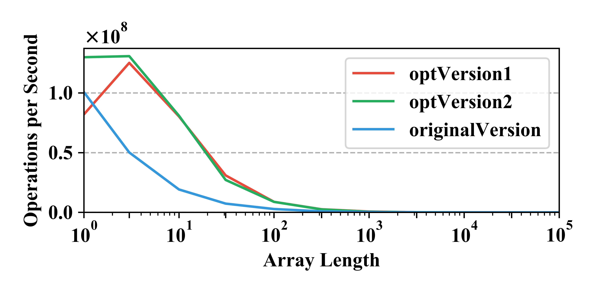
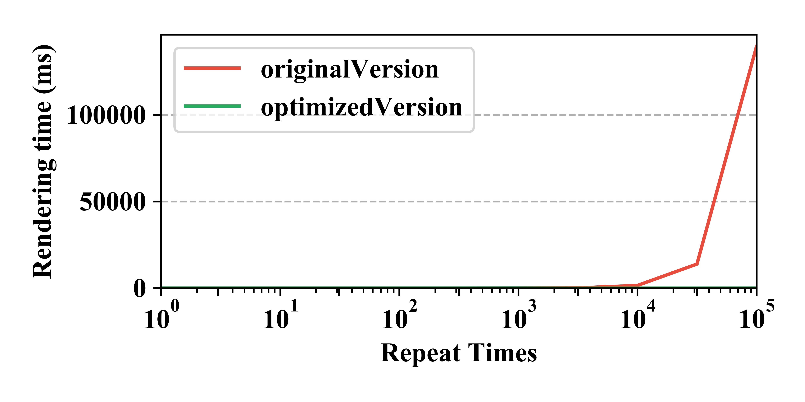
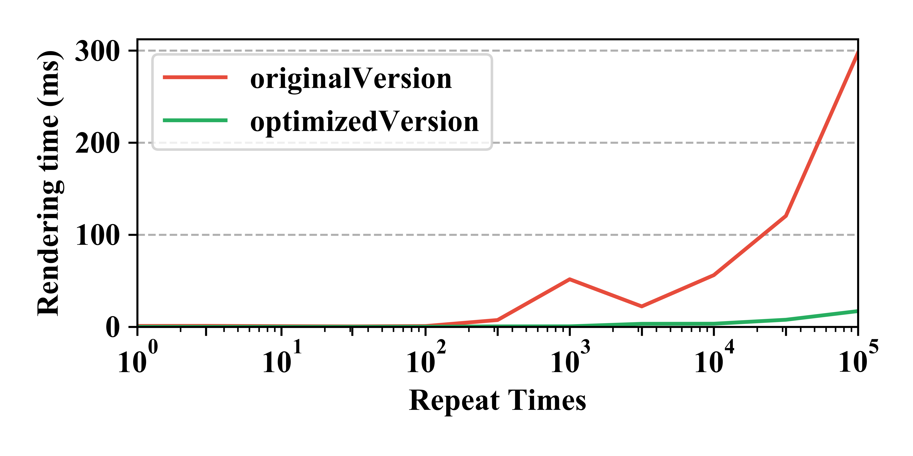

# JSOptimizer
### Under Construction...
These issue patterns, are observed from the popular projects like Tensorflow.js, Deno, Calypso,etc. The implement is based on the functional programming rules. This project is still on going.
## Environment Setup

> OS: 64bit Mac OS X 10.14.2 18C54
> 
> CPU: Intel Core i5-7360U @ 2.30GHz
> 
> RAM: 8GB
> 
> Server-side benchmark tool: Benchmark.js v2.1.4
> 
> Node.js: v10.5.0
> 
> Browser: Chrome Version 71.0.3578.98 (Official Build) (64-bit)


## Evaluation

### String Concatenation
> Affected Applications: Client and Server
> 
> Impact: Performance

#### Implementation

```js
const originalVersion = (str1,str2) => `${str1}${str2}`;
const optimizedVersion = (str1,str2) => str1+str2 ;
```
#### Performance


### Array Summation
> Affected Applications: Client and Server
> 
> Impact: Performance

#### Implementation

```js
const originalVersion=(arr)=>{
    let sum=0;
    arr.forEach((e)=>sum+=e);
    return sum;
};

const optVersion1=(arr)=> arr.reduce((prev=0,next=0)=> prev+next);

const optVersion2=(arr)=> arr.reduce((prev,next)=> prev+next, 0);
    
```
#### Performance



### Global Variable Leak
> Affected Applications: Client and Server
> 
> Impact: Memory Leak

#### Implementation

```js
window.onload = function () {
    /**
    * Leak to global context
    **/
    leakVariable={};
}
```
#### Performance
The variables that haven't declared in the appropriate context will lead to global variable leak. In some special scenarios, it will be conflict to the libraries variables.

### Global Variable Leak
> Affected Applications: Client and Server
> 
> Impact: Memory Leak

#### Implementation

```js
window.onload = function () {
    /**
    * Leak to global context
    **/
    leakVariable={};
}
```
#### Performance
The variables that haven't declared in the appropriate context will lead to global variable leak. In some special scenarios, it will be conflict to the libraries variables.

### Null Pointer
> Affected Applications: Client and Server
> 
> Impact: Runtime Crash

#### Implementation

```js
const dangerousFunction = () =>{
    const dangerousObj={};
    /**
    *   Null pointer opreation
    **/
    console.log(dangerousObj.a);
};
dangerousFunction();
```
#### Performance
The null pointer will cause the crash in the modern front-end application such as React.js, Vue,etc. It had bad effect in both server-side and client-side.

### Null Pointer
> Affected Applications: Client and Server
> 
> Impact: Runtime Crash

#### Implementation

```js
const dangerousFunction = () =>{
    const dangerousObj={};
    /**
    *   Null pointer opreation
    **/
    dangerousObj.a();
};
dangerousFunction();
```
#### Performance
The null pointer will cause the crash in the modern front-end application such as React.js, Vue,etc. It will have bad effect in both server-side and client-side.

### Console Output Leak
> Affected Applications: Client and Server
> 
> Impact: Memory Leak

#### Implementation

```js
const leakFunction = () =>{
    const normalObj={
        attr:"value"
    };
    /**
    *   Console log memory leak
    **/
    console.log(normalObj);
};
leakFunction();
```
#### Performance
In some scenarios, developers use console.log() to debug or display some runtime informations. However, it will make the object can not be collect by the GC. Even worse, the developers will usually forget to remove the log statements when they deliver the code to the production environment. The issues have been observed from some international companies, like Baidu.

### Closure Leak
> Affected Applications: Client and Server
> 
> Impact: Memory Leak

#### Implementation

```js
let res;
const outer = () => {
	let largeData = new Array(10000000);	
	let oldRes = res;
    /* Unused but leaks */
	const inner = () => {
		if (oldRes) return largeData;
	}
	return () => ();
}
setInterval(() => res = outer(), 10);
```
#### Performance
This kind of memory leak are very common and hard to aware by the developers. But it indeed leads to a large amount of resource consumption.

### Loop DOM Access
> Affected Applications: Client
> 
> Impact: Performance

#### Implementation

```js
    const LOOP_TIMES = 100000;
    const originalVersion = () => {
        for (var count = 0; count < LOOP_TIMES; count++) {
            document.getElementById("test").innerHTML += 'dom';
        }
    };
    const optimizedVersion = () => {
        let content = "";
        for (var count = 0; count < LOOP_TIMES; count++) {
            content += 'dom';
        }
        document.getElementById("test").innerHTML += content;
    };
    originalVersion();
    optimizedVersion();
```
#### Performance


### Initialized DOM Operation
> Affected Applications: Client
> 
> Impact: Performance

#### Implementation

```js
    const LOOP_TIMES = 1000;
    const originalVersion = () => {
        for (var count = 0; count < LOOP_TIMES; count++) {
            var element = document.getElementById("test1");
            element.style.height = "100px";
            element.style.borderLeft = "1px";
            element.style.padding = "20px";

        }
    };
    /**
    * Initial the new style
    * .newStyle {
    *    height: 100px;
    *    border-left: 1px;
    *    padding: 20px;
    * }
    **/
    const optimizedVersion = () => {
        for (var count = 0; count < LOOP_TIMES; count++) {
            var element = document.getElementById("test2");
            element.className = "newStyle";
        }
    };
    originalVersion();
    optimizedVersion();
```
#### Performance

### Initialized DOM Operation
> Affected Applications: Client
> 
> Impact: Performance

#### Implementation

```js
    const LOOP_TIMES = 1000;
    const originalVersion = (timeout) => {
        setTimeOut(()=>doSomethingRelatedToRender(),timeout);
    };
    const optimizedVersion = () => {
        requestAnimationFrame(()=>doSomethingRelatedToRender(),timeout);
    };
    originalVersion();
    optimizedVersion();
```
#### Performance

The setTimeout will execute after time out. But it depends on the main thread. If it is not free at time out，then it will be delay.

The requestAnimationFrame do not need timeout setting.When the browser refreshes, it will call the callback function defined in the requestAnimationFrame. The browser will automatically optimize the callback function. Besides, if the page is not active, the animation will pause automatically to save the CPU consumption.


